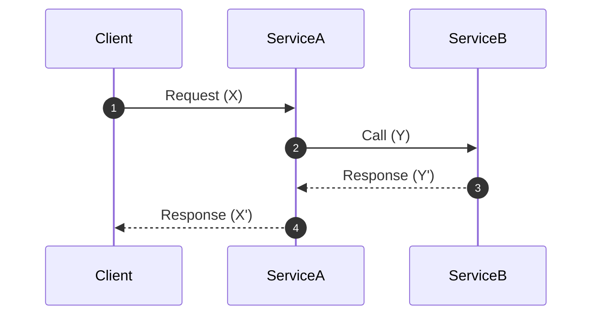
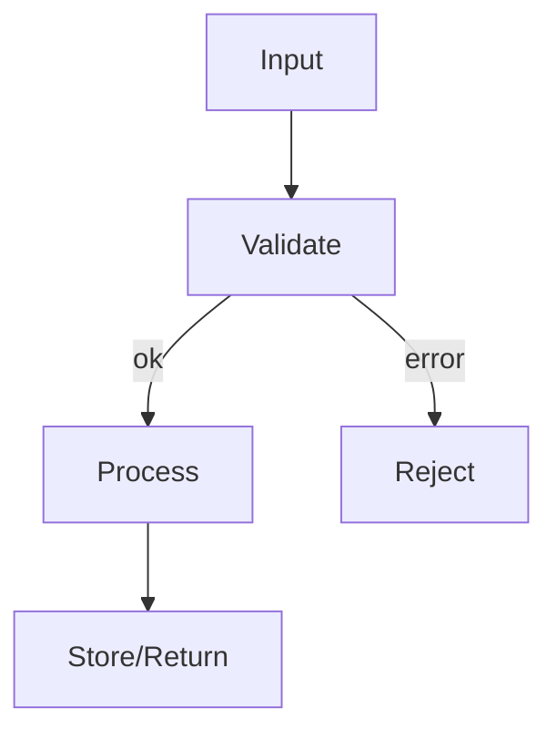

# Architecture Decision Record (ADR) 0000: <Concise Title>

Status: Proposed | Accepted | Rejected | Superseded
Date: YYYY-MM-DD

Audience & Style

- Assume a junior engineer is reading this. Prefer clarity over brevity.
- Define first, then explain What, How, Why. Include an analogy and diagrams for complex ideas.

## Definitions

- Define key terms up front so reviewers share the same language. Keep concise (1–2 lines each).
- Examples: Component names, data model terms, protocol names, external systems, scope identifiers, versioning terms.

## Context

- Describe the problem, motivation, and constraints.
- Who is impacted (users, services), and why now?
- Prior art and related work in the codebase or industry.
- Non-goals (explicitly list what’s out of scope).

## Decision

- State the decision clearly and unambiguously.
- Include high‑level architecture and boundaries (APIs, data flow, ownership).
- If applicable, call out the chosen libraries, protocols, or services.

### What

- Describe what is being introduced or changed in one or two paragraphs.

### How

- Outline the approach, components involved, and interactions.
- Provide a sequence or component diagram (Mermaid recommended).

### Why

- Explain the reasoning and tradeoffs in approachable language.
- Link back to constraints in Context.

### Analogy

- Offer a simple analogy that maps the concept to something familiar (e.g., “think library catalog vs. bookshelf”).

## Consequences

- Pros: List the benefits of this approach.
- Cons: List the tradeoffs, costs, and risks.
- Mitigations: How we’ll minimize risks or complexity.

## Alternatives Considered

- Summarize 2–3 realistic alternatives and why they were not chosen.
- Include a brief comparison on complexity, risk, cost, and fit.

## Implementation Notes

- How to implement the decision safely and incrementally.
- Touch points: code areas, repos, deploy targets.
- Versioning & migrations: schema, API, data migrations, backwards compatibility.
- Testing strategy: unit, property-based, integration, e2e.

## Diagrams

- Include any additional sequence, component, or state diagrams to aid understanding.

## Rollout Plan

- Phases and milestones with success criteria.
- Feature flagging / canary approach.
- Rollback plan and safe abort criteria.

## Metrics & Observability

- What to measure to validate success (latency, error rate, freshness, etc.).
- Logs, metrics, and traces to add; dashboards and alerts.

## Security & Privacy

- Threat model basics: trust boundaries, inputs validation, secrets handling.
- Data handling: PII, retention, encryption in transit/at rest.

## Open Questions

- Things that require follow‑up or separate ADRs.
- Unknowns and assumptions we’re explicitly making.

## Changelog

- YYYY‑MM‑DD: Initial proposal.
- YYYY‑MM‑DD: Accepted/Rejected/Superseded by ADR‑XXXX.

---

Process Guidance (How to craft an ADR for big features)

1. Draft early, keep short first

- Start with the problem (Context) and a strawman (Decision). Don’t polish diagrams first.
- Add key Definitions so reviewers share the same vocabulary.

2. Socialize before building

- Open a PR with the ADR file; link related issues/PRs.
- Ask for async feedback from affected owners (CODEOWNERS).

3. Compare alternatives

- Add 2–3 realistic Alternatives with clear tradeoffs.
- Be explicit about risks and mitigations (Consequences).

4. Plan the rollout

- Write Implementation Notes and a Rollout Plan that can be executed incrementally.
- Include metrics and alerts to know if it’s working (Metrics & Observability).

5. Decide and record

- Update Status to Accepted/Rejected, add the Date.
- If superseding an older ADR, reference it in both directions.

6. Keep it living

- If reality changes materially, add a Changelog entry or a new ADR that supersedes this one.

Naming & Numbering

- File name: `docs/ADRs/NNNN-descriptive-title.md` where NNNN is the next integer.
- Title: Start with the ADR number and a short, descriptive phrase.
- Scope: One decision per ADR; split if it grows too large.
