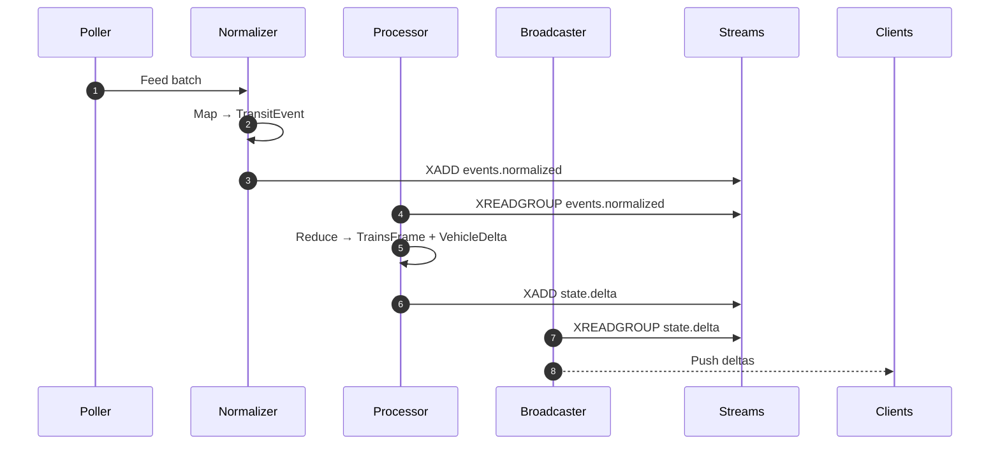

# Architecture Decision Record (ADR) 0002: Ingest Pipeline via Valkey Streams

Status: Accepted
Date: 2025-09-21

## TL;DR
- Use Valkey Streams as the event bus between ingest, normalize, process, and broadcast.
- Topics include `events.normalized` (canonical events) and `state.delta` (vehicle deltas). Retention is short (e.g., minutes) with `MAXLEN ~ N`.
- Consumer groups (`normalizer`, `processor`, `broadcaster`) cooperatively read; we monitor backlog and trim.
- Simpler than Kafka for local dev; sufficient for at‑least‑once, short‑horizon replay.

## Definitions

- Stream: An append-only sequence of messages (Valkey Streams) supporting IDs, consumer groups, and limited replay.
- Consumer group: Named group of consumers that cooperatively read from a stream, tracking pending messages per consumer.
- Retention: Strategy to cap stream length/age (e.g., `MAXLEN ~ N`), balancing replay needs against memory.
- TransitEvent: Canonical event produced by normalizers (e.g., `vehicle.upsert`/`vehicle.remove`).
- EventEnvelope: Versioned wrapper `{ schemaVersion, data: TransitEvent }` published on streams.
- VehicleDelta: Reduced change set computed by the processor between frames; emitted to subscribers.

## Context

We need a reliable, local‑friendly, and simple event transport to connect pollers, normalizers, processors, and the broadcaster. The system should support replay (short horizon), consumer groups, and easy local ops without Kafka’s operational overhead.

## Decision

Use Valkey Streams as the event bus for ingest and deltas with aggressive retention:

- Topics: `vehicles.raw`, `alerts.raw`, `stations.raw`, `events.normalized`, `state.delta`.
- Consumer groups: `normalizer`, `processor`, `broadcaster`, and future `persistence`.
- Retention: `XADD ... MAXLEN ~ N` with short replay windows (minutes) plus optional age‑based trimming.

## Consequences

- Pros: Zero external broker dependency, simple local dev (Docker Compose), supports at‑least‑once and replay, easy to shard by topic.
- Cons: Not a distributed log; limited tooling vs. Kafka; need explicit trimming and backlog monitoring.

## Alternatives Considered

- Kafka: Excellent durability and tooling but heavy for local dev and our scope.
- NATS: Lightweight pub/sub but streams and replay would require JetStream setup.

## Implementation Notes

- Namespacing and key conventions documented in Architecture (Storage Mapping).
- Metrics: backlog depth, pending per consumer group, trim rate.

## What / Why / How

### What
Valkey Streams act as the backbone for passing canonical `TransitEvent`s and reduced `VehicleDelta`s across pipeline stages with short replay.

### Why
- Lightweight and easy to run locally (Docker Compose), matching our current scale.
- Supports consumer groups and limited replay without the operational overhead of Kafka.

### How
- Writers `XADD` to well‑named topics with `MAXLEN ~ N` to bound memory.
- Readers join consumer groups, `XREADGROUP` with sensible timeouts, and acknowledge with `XACK`.
- Backpressure and retries are handled via pending entries lists; monitoring ensures no starvation.

### Analogy
Think of Streams like a rolling whiteboard: new notes are added on the right, old notes get erased as space runs out. Teams (consumer groups) copy notes to their notebooks (state) and check them off when done.

### Sequence (High‑Level)

