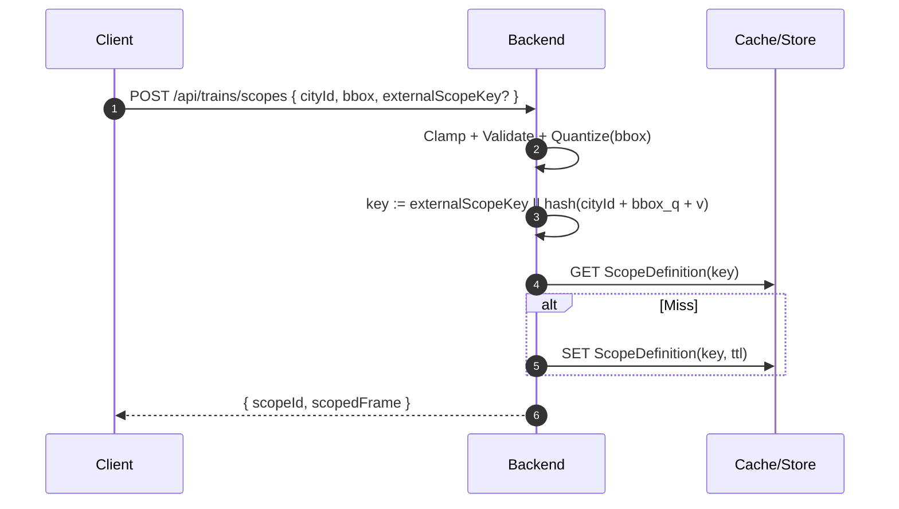

# Architecture Decision Record (ADR) 0004: Viewport Scope Provisioning (POST + scopeId)

Status: Accepted
Date: 2025-09-21

## TL;DR

- POST a bbox `{ south, west, north, east, zoom? }` with `cityId` to mint a reusable `scopeId` and get a scoped snapshot.
- Server clamps, validates, quantizes (default ~1e‑4°), computes an idempotent key from `cityId + quantized bbox (+ schemaVersion)`, and caches the ScopeDefinition.
- `zoom` is a hint for shaping (cluster/limits), not part of identity. Optionally accept `externalScopeKey` for client‑driven idempotency.
- Antimeridian is out of scope for region‑bounded views; if needed later, split into two scopes.

## Definitions

- CityId: Non-empty identifier for the operating area (e.g., `nyc`, `tokyo`).
- BBox: Geographic bounding box `{ south, west, north, east, zoom? }` in WGS84 degrees; `zoom` is a hint (0–22).
- ViewportRequest: Request body `{ cityId, bbox }` sent to provision a scope.
- ScopeDefinition: Normalized and quantized bbox stored server-side with associated `cityId` and metadata.
- Quantization: Rounding bbox coordinates to a fixed precision (e.g., 1e‑6 deg) to avoid producing distinct scopes for insignificantly different inputs.
- ScopeId: Minted, reusable identifier derived from `cityId + quantized bbox (+ schemaVersion)`, used to fetch snapshots/deltas.
- SchemaVersion: Version tag included in envelopes so producers/consumers can evolve independently while retaining compatibility.

## Context

The map should subscribe to live updates only for what’s visible. Passing long tile lists via GET hits URL limits and is hard to cache coherently.

## Decision

Introduce a POST‑based scope provisioning API that mints a reusable `scopeId`:

- `POST /api/trains/scopes` with `{ cityId, bbox }` → quantize → store ScopeDefinition → return `ScopedTrainsFrame + scopeId`.
  - Optional `externalScopeKey` enables client-driven idempotency when re-provisioning equivalent scopes.
- Subsequent requests use `scope=<scopeId>` (`GET /api/trains`, `/api/trains/stream`).
- Input shape is bbox‑only. Quantization (e.g., 1e‑4 degrees ≈ 11 m) stabilizes cache keys and idempotent scopeIds.

### API Contract (Request)

```json
{
  "cityId": "nyc",
  "bbox": { "south": 40.7, "west": -74.02, "north": 40.76, "east": -73.96, "zoom": 12 },
  "externalScopeKey": "optional-client-key"
}
```

Response (conceptual): returns `ScopedTrainsFrame` and `scopeId`.

## What / Why / How

### What

Scopes define a reusable viewport over a city. Clients POST a bbox; the server quantizes it, stores a ScopeDefinition, and returns a `scopeId` plus a scoped snapshot for immediate use.

### Why

- Single input shape (bbox) simplifies clients and server.
- Quantization prevents tiny drags from creating new scopes; it enables idempotent `scopeId`s and cache reuse.
- A zoom hint lets the server shape payloads (cluster/limit) without fragmenting identities.

### How

- Clamp → Validate → Quantize bbox, then compute a deterministic key from `cityId + quantized bbox (+ schemaVersion)`.
- Prefer `externalScopeKey` when provided (after validating bbox) for idempotent client-driven provisioning.
- Lookup existing scope by key; on miss, insert with TTL and compute the scoped snapshot.

### Analogy

Think of a scope as a photo frame on the map. The bbox is the frame’s edges, quantization snaps the frame to a neat grid so tiny nudges don’t create a “new frame,” and the zoom hint tells how much detail to include in the print.

## Consequences

- Pros: Short URLs, cacheable snapshots, easy shareability, consistent filtering for deltas.
- Cons: Extra round trip to mint scope; need eviction policy for stale scopes.

## Alternatives Considered

- GET with tiles param only: Shareable but fragile due to URL length constraints.
- Server‑side per‑connection filters without `scopeId`: Harder to debug, no cache reuse.

## Implementation Notes

- Valkey keys: `viewport:<scopeId>` store scoped frames with sub‑minute TTL.
- Broadcaster validates membership against stored ScopeDefinition when routing deltas.
- ScopeIds are derived from `cityId + quantized bbox + schemaVersion` (hashed as needed) for idempotency. If clients provide `externalScopeKey`, prefer it for lookup/insert (after validation) to ensure idempotent behavior across app restarts.

### Web Mercator & Bounds

- Web Mercator (EPSG:3857) is the standard web map projection. Clamp latitude to ±85.05113° and longitude to ±180° to stay within its valid domain. Internally we project to meters; input/identity use WGS84 degrees.

### Antimeridian Handling (Future)

- Current schema rejects `east < west`. If we need to support crossing the dateline, split the request into two scopes (west and east segments) to keep filtering and caching logic simple.

### Server Behavior (Recommended)

- Reject invalid bboxes (north < south, east < west) with clear messages.
- Quantize bbox (e.g., default 1e‑4 deg ≈ 11 m; optionally vary with zoom ≈ 1–2 px).
- Exclude `zoom` from identity; use it only to shape payloads (cluster/limit thresholds).
- Cache ScopeDefinition under the computed key with a short TTL (e.g., 1–2 minutes).
- Return `ScopedTrainsFrame` and `scopeId`; subsequent polling or streams use the `scopeId`.

### Client Guidance

- Preferred: derive bbox via `map.getBounds()` and send `zoom: Math.round(map.getZoom())` (server clamps 0–22).
- Debounce re-provisioning and only POST when bbox changes beyond quantization.
- Avoid massive bboxes at low zooms; pan/zoom closer or accept clustered responses.

Map config checklist (region‑bounded views)

- MapLibre/Mapbox GL: `maxBounds: <region bbox>`, `renderWorldCopies: false`
- Leaflet: `setMaxBounds(<region bbox>)`, `worldCopyJump: false`

### Sequence (Provisioning)



## Future Evolution

- Dynamic quantization tied to zoom and screen DPI.
- Client-provided idempotency keys at scale (key format conventions and quotas).
- Antimeridian support via split scopes or wrapped coordinates.
