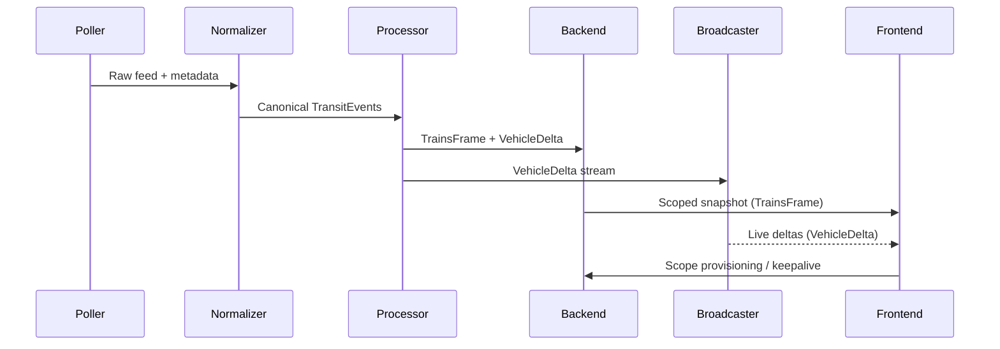
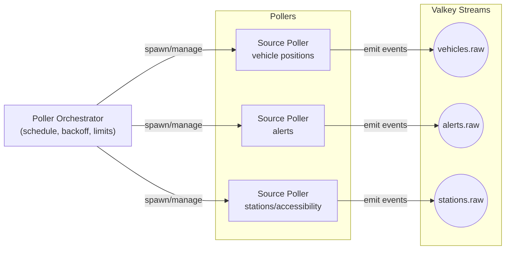
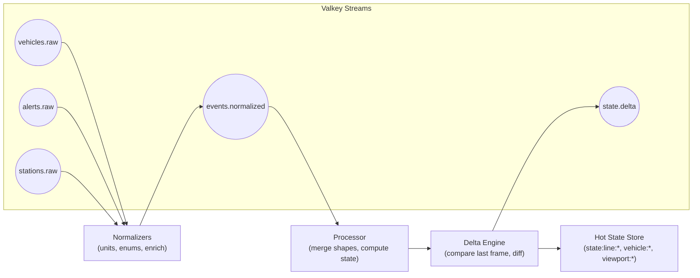
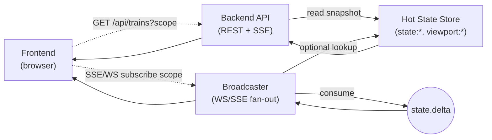
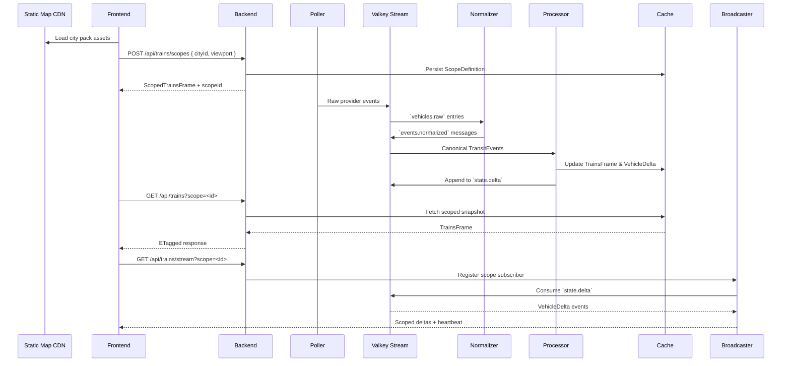
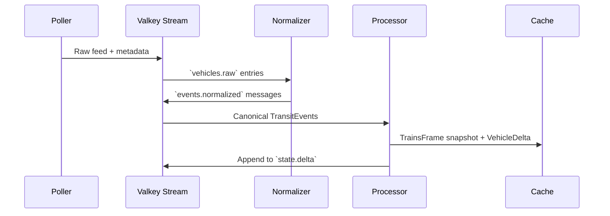
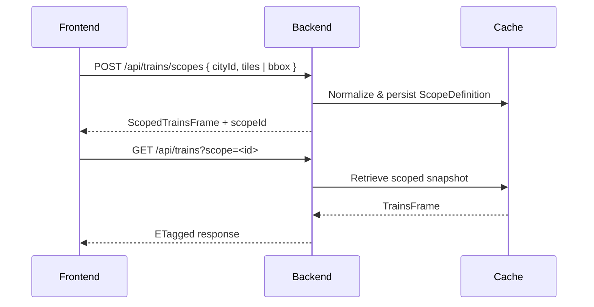
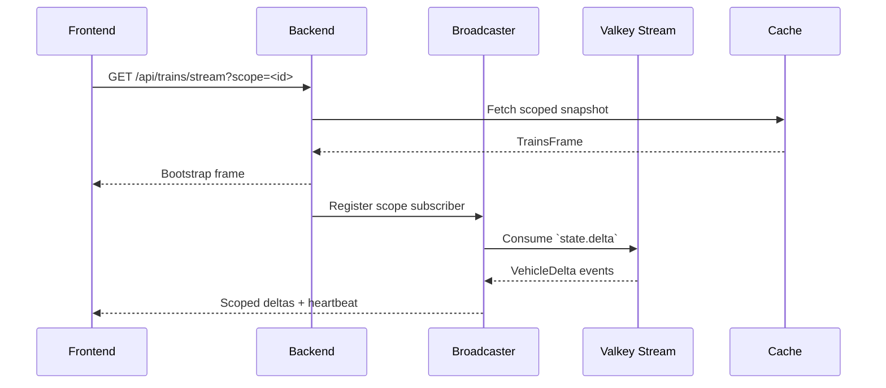
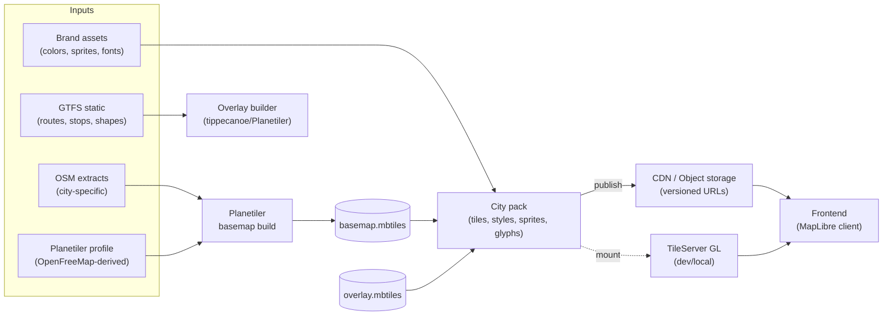

# Architecture

## Overview

OpenTransitMap is organized as a process pipeline that ingests real-time transit feeds, normalizes them into house schemas, computes derived vehicle state, and publishes updates to clients over both REST and streaming interfaces. Each stage is independently observable and replaceable, enabling us to run locally today (via Docker Compose) while staying deploy-ready for future milestones.

## What's Inside

- [Plain-English Walkthrough](#plain-english-walkthrough)
- [Key Terms](#key-terms)
- [Core Resources & Their Roles](#core-resources--their-roles)
- [Ingest Layer](#ingest-layer)
- [Stream Transport](#stream-transport-valkey-streams)
- [Processing & State](#processing--state)
- [Delivery Layer](#delivery-layer)
- [Viewport-Aware Delivery](#viewport-aware-delivery)
- [Key Sequence Diagrams](#key-sequence-diagrams)
- [Map & Tiles](#map--tiles)
- [Authentication, Authorization, and Secrets](#authentication-authorization-and-secrets)
- [Observability & Operations](#observability--operations)
- [Security & Client Limits](#security--client-limits)
- [Deployment Model (Current vs. Future)](#deployment-model-current-vs-future)
- [Extensibility & ADRs](#extensibility-considerations)

## Plain-English Walkthrough

Picture a relay race where data runs the baton across the system:

- **Poll** – Feed-specific workers grab whatever the transit agency publishes, tagging each batch with metadata before passing the baton.
- **Translate** – Normalizers speak every provider’s dialect, converting those raw messages into the shared language our own services understand.
- **Process** – The processor keeps the scoreboard, comparing fresh updates against the last frame so we know exactly what changed and cache both the full state and the diffs.
- **Serve** – When someone opens the map, the backend shares the current scoreboard for their viewport and keeps the connection alive so any new plays stream in immediately.
- **Broadcast** – A dispatcher watches who’s tuned in to which tiles and only shouts the updates that matter to each group.
- **Frontend** – The Vite app draws the basemap, listens for deltas, and animates trains so riders see a living network.
- **Guardrails** – Observability, security, and rate limiting watch the sidelines so we spot issues before riders do.

## Key Terms

- **TrainsFrame**: Authoritative snapshot of every in-service vehicle (metadata, geometry, status) at a specific ingest timestamp.
- **ScopedTrainsFrame**: A TrainsFrame filtered to a viewport. Responses include the bounding box, zoom hint, `scopeId`, and checksum so clients can reconcile deltas.
- **VehicleDelta**: Minimal change event describing vehicles that appeared, moved, or were removed since the previous frame. Always carries latest geometry, identifiers, status, and the `scopeId` it was derived from.
- **scopeId**: Stable identifier (e.g., hashed viewport params + schema version) used by clients to correlate a scoped snapshot with subsequent deltas and cache entries (`viewport:<hash>`).
- **cityId**: Identifier for the operating area (`nyc`, `tokyo`, etc.) that selects the static GTFS bundle, tile set, and cache namespace used to fulfill a request.
- **BBox**: Geographic bounding box `{ south, west, north, east, zoom? }` (WGS84 degrees). The backend quantizes bbox coordinates to a fixed precision (e.g., 1e‑6) before minting a scope.
- **Quantization**: Rounding bbox coordinates to a fixed precision to make cache and scope IDs idempotent across nearly-identical inputs.
- **SchemaVersion**: Version tag included in event envelopes to support safe schema evolution.
- **Viewport request payload**: JSON body posted to `/api/trains/scopes` with `cityId` and `bbox` `{ south, west, north, east, zoom? }`. The backend quantizes the bbox before generating an idempotent `scopeId` and slicing the snapshot.
- **Scope provisioning**: `POST /api/trains/scopes` mints a reusable `scopeId`, stores the normalized viewport definition, and returns the scoped snapshot. Subsequent GET/SSE calls use `scope=<scopeId>` for shareable, URL-safe access.
- **City pack**: Prebuilt bundle for a transit area containing basemap tiles, transit overlays, sprites, glyphs, and style JSON served via CDN or TileServer GL.
- **Static overlay**: Vector tiles derived from GTFS static data (routes, stations, transfers) rendered consistently with the transit agency’s official branding.
- **WebSocket (WS)**: A persistent, full‑duplex connection over HTTP(S) upgrade used for bidirectional messaging. We use WS primarily for high‑fan‑out, low‑latency live updates where clients may also send control messages.
- **Server‑Sent Events (SSE)**: A unidirectional HTTP stream (`text/event-stream`) from server to client with built‑in reconnection and simple semantics. We use SSE for push‑only live updates when bidirectional messaging isn’t needed.
- **state.delta**: The Valkey Stream topic that carries `VehicleDelta` events (compact changes between frames). It uses aggressive retention (`MAXLEN ~ N`) to keep only a short replay window.
- **Hot State Store**: The in‑memory Valkey data model (hashes/sorted sets) holding authoritative, query‑friendly snapshots: `state:line:*`, `vehicle:*`, and `viewport:*` entries used by the read APIs and bootstrap responses.
- **ETag**: An HTTP response header containing a content validator. Clients send `If-None-Match` with the ETag to get `304 Not Modified` when data hasn’t changed, reducing bandwidth.
- **CDN**: A Content Delivery Network (edge cache) that serves versioned static assets (tiles, styles, sprites, glyphs) close to users for lower latency and load on origin.

## Core Resources & Their Roles

- **Valkey Streams** (`vehicles.raw`, `events.normalized`, `state.delta`, etc.): act as our topic bus for ingest and delta fan-out; each consumer group acknowledges entries once processed.
- **Valkey Hashes / Sorted Sets** (`state:line:*`, `vehicle:*`, `viewport:*`): hold hot state snapshots, per-vehicle metadata, and short-lived viewport caches for fast API reads.
- **Tile Artifacts** (`tile-assets/` plus MBTiles such as `tiles/<cityId>.mbtiles`): generated by Planetiler runs; TileServer GL mounts these to serve vector tiles, styles, sprites, and fonts.
- **Secrets Directory** (`secrets/<provider>.key`): file-mounted credentials polled by services needing upstream access.
- **Edge Proxy (Envoy + OPA)**: terminates client traffic, enforces authentication/authorization, and injects trusted headers; bypassed only in local dev mode.
- **Observability Stack (OTel Collector, Tempo, Prometheus, Loki)**: collects spans, metrics, and logs emitted uniformly across services.
- **Docker Compose & Make Targets**: orchestrate local instances of the above, ensuring contributors can run the full stack without bespoke setup.

## Ingest Layer

- **Poller Orchestrator**: A stateful controller that schedules feed-specific poller subprocesses. It applies global concurrency limits, per-source backoff, and tracks last-seen checkpoints so each poller resumes cleanly after restarts.
- **Source Pollers**: TypeScript workers dedicated to a single upstream feed (e.g., realtime positions, alerts, accessibility). Responsibilities:
  - Enforce provider SLAs (timeouts, rate limits) and emit structured fetch metadata (duration, HTTP status, checksum).
  - Parse responses with Zod, tagging each record with `providerId`, `sourceId`, `fetchedAt`, and an idempotency key (`providerId:entityId:timestamp`).
  - Emit raw snapshots to Valkey Streams; the snapshot vs. delta decision is deferred to downstream consumers—pollers always emit the smallest unit the provider exposes so replay is lossless.
- **Stream Topics**: Each concern (`vehicles.raw`, `alerts.raw`, `stations.raw`, etc.) maps to a dedicated Valkey Stream, giving us logical topics without needing Kafka.

### Ingest Topology

This diagram shows how the orchestrator supervises per-source pollers, which write into separate Valkey stream topics for downstream consumers.

## Stream Transport (Valkey Streams)

- Streams provide at-least-once delivery with persistence and replay, suiting our desire to reprocess historical frames if schemas evolve.
- Aggressive retention keeps the real-time pipeline lean: writes use `XADD ... MAXLEN ~ N` (e.g., ~5k messages ≈ minutes of history) and a periodic trim job enforces age-based cutoffs so unacknowledged backlogs surface quickly.
- Consumer groups partition the workload:
  - `normalizer`: converts provider payloads into canonical `TransitEvents`.
  - `processor`: builds aggregate state and deltas.
  - `broadcaster`: publishes real-time diffs.
- Message envelopes carry a `schemaVersion` and trace headers so observability spans can continue across stages.

### Storage Mapping

- Streams (append-only topics):
  - `vehicles.raw`, `alerts.raw`, `stations.raw` → raw ingest events per concern
  - `events.normalized` → agency‑agnostic normalized events
  - `state.delta` → `VehicleDelta` updates for live fan‑out (aggressively trimmed)
- Hot state (queryable keys in Valkey):
  - `state:line:<id>` → per‑line snapshots from the latest `TrainsFrame`
  - `vehicle:<tripId>` → per‑vehicle metadata/state
  - `viewport:<scopeId>` → scoped snapshots used to bootstrap clients

## Processing & State

- **Normalizers**: Map provider-specific fields into canonical enums, coordinate systems, and units (`meters`, `seconds`, `ISO timestamps`). They also enrich events with static GTFS-derived metadata (route names, colors) and write `TransitEvent` messages to `events.normalized`.
- **Derived State Builders**:
  - Merge static shapes and realtime positions to compute on-track coordinates, speed, and direction.
  - Calculate headways, delays, and line summaries for dashboards.
  - Validate the resulting `VehicleState` with Zod before emitting to `state.vehicle`.
- **Delta Engine**: Compares the latest state to the previously published frame, producing compact `VehicleDelta` payloads (moved vehicles, new alerts, removed trains). Each delta includes the vehicle's latest geometry (lat/lon plus track reference) and scope metadata so downstream filters can route it correctly. The engine also writes the full, validated `TrainsFrame` snapshot to Valkey so new consumers have an authoritative baseline before applying deltas.
- **Hot State Store**: Valkey hashes and sorted sets maintain:
  - Per-line snapshots (`state:line:<id>`).
  - Per-vehicle metadata (`vehicle:<tripId>`).
  - Short-lived aggregates for heavy queries (station rollups) with TTLs to avoid stale data.
  - Viewport caches (`viewport:<hash>`) containing scoped `TrainsFrame` slices and a `scopeId` so quick pans can reuse server-side state.

### Processing Topology

This topology shows normalized events flowing into processors that update the authoritative cache and emit compact deltas for streaming.

### Shared Schema Contracts

- All contracts live in `packages/types/src/schemas/` as Zod definitions exported alongside derived TypeScript types via `z.infer`.
- `TransitEventSchema`: normalized raw feed event (provider metadata, timestamps, vehicle/station identifiers, payload hash).
- `TrainsFrameSchema`: authoritative global snapshot; `ScopedTrainsFrameSchema` wraps it with `scopeId`, viewport metadata, and checksum.
- `VehicleStateSchema`: per-vehicle status embedded inside frames; `VehicleDeltaSchema` captures change events and carries geometry + `scopeId`.
- `ViewportRequestSchema`: validates the POST payload (`cityId`, `tiles[] | bbox`) and pins precision rules so both backend and broadcaster generate identical `scopeId`s.
- `ScopeDefinitionSchema`: what we persist in Valkey to describe each scope (normalized tiles, bbox, hash components, schema version).

## Delivery Layer

- **Backend API** (`services/backend`): A typed Express service that fronts the cache.
  - `POST /api/trains/scopes`: Single entry point for viewport provisioning. Accepts JSON payloads that include `cityId` and either a `tiles` array or `bbox` object. The service normalizes inputs, mints a reusable `scopeId`, caches the definition, and returns the scoped snapshot plus metadata.
  - `GET /api/trains`: Serves the latest global `TrainsFrame` snapshot when called without query params. With `scope=<scopeId>` it returns the cached scoped snapshot without resending parameters.
  - `GET /api/trains/stream`: Sends the current scope's `TrainsFrame` as a bootstrap event, then tails `state.delta` to stream incremental updates. Clients stitch deltas onto the bootstrap state, so late joiners never rely on historical stream retention.
  - Additional endpoints (`/api/alerts`, `/api/meta`) reuse the same cache abstractions.
- **Broadcaster Service**: Listens on `state.delta`, mirrors the hot state for quick lookups, and performs fan-out to WebSocket rooms (citywide, `line:<id>`, `station:<id>`, `bbox:<hash>`, `tile:<z>/<x>/<y>`). It maintains lightweight spatial indices (geohash buckets or per-line R-trees) so each delta is routed only to affected subscribers and viewport caches stay fresh. The backend SSE endpoint can proxy this broadcaster or share the same subscription plumbing depending on deployment.
  - Responsibilities include: (1) consuming validated `VehicleDelta` records; (2) re-validating scope eligibility against `ScopeDefinition` entries; (3) refreshing `viewport:<hash>` caches when deltas affect their tiles; and (4) reporting fan-out health through the shared observability hooks (spans, metrics, structured logs).

### Delivery Topology

This diagram highlights how snapshots come from the hot cache via REST, while scoped live updates fan out from the broadcaster consuming `state.delta`.

### Viewport-Aware Delivery

- The frontend maintains an active viewport (set of visible tiles and optional bounding box metadata). When users pan/zoom beyond cached bounds they post the updated definition to `/api/trains/scopes`. Responses include a `scopeId` the client reuses when opening streaming channels or constructing shareable URLs (`/api/trains?scope=...`).
- Scoped streaming channels (`bbox:<hash>`, `tile:<z>/<x>/<y>`, etc.) deliver deltas filtered to the viewport. Clients subscribe/unsubscribe as the map moves, and multiple overlapping subscriptions are supported for fast scroll scenarios.
- The broadcaster keeps lightweight spatial indices (e.g., per-line R-tree) to route a delta to the right channels and to refresh viewport caches proactively when large moves occur. REST snapshots and stream fan-out both derive from the same authoritative hot state, ensuring consistency across tiles.
- Short-lived Valkey caches store recent viewport results so rapid pans can reuse data without re-slicing the full frame.

## Key Sequence Diagrams

### High-Level Overview

### Ingest Pipeline

### Scope Provisioning

### Live Update Loop

Each diagram highlights where observability (OTEL telemetry) and security boundaries (Envoy/OPA) apply so contributors can trace data through the system end-to-end.

## Map & Tiles

### Overview

- City packs deliver the static map foundation: a Planetiler-built basemap, transit overlays derived from GTFS static data, sprites, glyphs, and style JSON. The frontend loads these assets first, then layers realtime trains on top so the map stays responsive even if live feeds lag.

### Map & Tiles Topology

The diagram shows how inputs are compiled into MBTiles, bundled as a versioned city pack, and delivered via CDN in production or TileServer GL in development. The frontend consumes the style.json, glyphs, sprites, and vector tiles from these sources before layering realtime data.

### Build Pipeline

- **Inputs**: City-specific OpenStreetMap extracts, the shared Planetiler profile (derived from OpenFreeMap), agency branding assets (official colors, fonts, sprites), and GTFS static feeds.
- **Basemap**: Run Planetiler with the profile scoped to each city’s bounding geometry to produce compact `.mbtiles` basemaps that retain the OpenMapTiles schema and styling tweaks.
- **Transit overlays**: Dissolve GTFS shapes by route and station, enrich with official names and colors, and tile via Planetiler or tippecanoe into overlay MBTiles (stored under `tiles/overlays/<cityId>`).
- **Bundling**: Package basemap, overlays, sprites, glyphs, and style JSON into a versioned city pack so updates publish atomically and can be rolled back if needed. City packs remain agency-agnostic—swap in another network’s inputs to generate a new bundle.
- **Manifest wiring**: `manifest.json` entries reference the packaged assets, set map bounds/zoom, and declare overlay layers so the frontend assembles the static map before realtime data arrives.

### Delivery

- **Local development**: Docker Compose runs TileServer GL against the generated MBTiles, exposing `tileserver/style.json`, sprites, and glyphs so the frontend can iterate without CDN connectivity.
- **Production hosting**: City packs publish to object storage behind a CDN with versioned URLs (e.g., `/tiles/v{n}/...`) and long cache lifetimes; manifests include checksums so clients detect new releases.
- **Frontend consumption**: Selecting a city pulls the manifest, applies bounds/zoom constraints, loads basemap and overlay sources from CDN or TileServer GL, then attaches the realtime `trains` source supplied by the streaming backend.

## Authentication, Authorization, and Secrets

- **Edge Security**: Envoy (running as a sidecar or gateway) validates JWTs, enforces rate limits (global + per-subject), and injects trusted identity headers (`x-sub`, `x-scope`, `x-tier`, `x-trace-id`).
- **Policy Engine**: Envoy delegates fine-grained decisions (e.g., which lines a user may access) to an OPA ext_authz service.
- **Backend Trust Model**: Internal services reject direct client headers, trusting only Envoy-signed metadata. Locally we provide a development profile that bypasses Envoy but still requires the headers (set via compose).
- **Secret Distribution**: All upstream credentials reside in file-mounted secrets (`secrets/<provider>.key`). A shared secret poller library watches for file rotations and hot-reloads values without restarts.

## Observability & Operations

- **OpenTelemetry**: Every process emits OTLP traces, metrics, and logs to an in-compose OTel Collector, which fans out to Tempo/Jaeger (traces), Prometheus (metrics), and Loki (logs). Trace propagation follows W3C headers end to end (browser → backend → cache → broadcaster → client).
- **Metrics**: Standard RED/USE instrumentation plus domain-specific signals: poller lag vs. upstream timestamps, stream backlog depth (alerts fire if processing exceeds the sub-minute retention window), cache hit ratios, broadcast fan-out rates, per-line update latency.
- **Logging**: Structured JSON (Pino) with correlation IDs, feed identifiers, timing, and outcome. No PII or secrets are logged; Promtail/Loki handle redaction where necessary.
- **Alerting**: Rules on freshness (no vehicle updates for N seconds), poller error rates, SSE/WebSocket connection churn, and cache saturation.

## Security & Client Limits

- **Rate Limiting**: Dual levers at Envoy (token/IP buckets) and application-level safeguards (e.g., SSE connection caps). Responses expose standard rate-limit headers.
- **CORS & Transport**: Restrict cross-origin requests, enforce HSTS, and serve compressed payloads (gzip/br) for bandwidth savings.

## Deployment Model (Current vs. Future)

- **Local**: Docker Compose orchestrates all services—frontend, backend, poller pipeline, Valkey, TileServer GL, Envoy, OTel collector. Targets in the Makefile spin the stack up with seeded secrets and mocked feeds for offline development.
- **Future**: The same process boundaries translate to Kubernetes deployments with horizontal scaling per stage, sidecar Envoy proxies, and managed storage for tiles and telemetry stacks.

## Extensibility Considerations

- Provider-specific logic is isolated in pollers and normalizers; the canonical schemas in `packages/types` protect downstream consumers from upstream quirks.
- Schema evolution uses versioned Zod definitions with compatibility layers so older clients continue to function.
- ADRs will capture key decisions: multi-stage pipeline, Valkey stream transport, schema strategy, edge security stack, and observability tooling.
- Tile semantics follow standard Web Mercator (slippy tiles), so additional cities generate their own tile sets and reuse the same viewport/tile API; the `cityId` parameter keeps caches and schema adaptations isolated per agency.

### Architecture Decision Records (ADR) & Implementation Guideposts

- **ADR-0001**: Record Architecture Decisions (process for using ADRs).
- **ADR-0002**: Ingest pipeline via Valkey Streams (poller → normalizer → processor → broadcaster) with aggressive retention.
- **ADR-0003**: Shared schemas with TypeScript + Zod (contracts, versioning, validation boundaries).
- **ADR-0004**: Viewport scope provisioning (POST + `scopeId`, tile/bbox support, cache strategy).
- **ADR-0005**: Edge security posture (Envoy + OPA, rate limits, trusted headers, local dev profile).
- **ADR-0006**: Observability via OpenTelemetry Collector (fan-out to Tempo/Jaeger, Prometheus, Loki).
- Each ADR records decision, context, alternatives, consequences, and implementation notes to keep onboarding straightforward.
