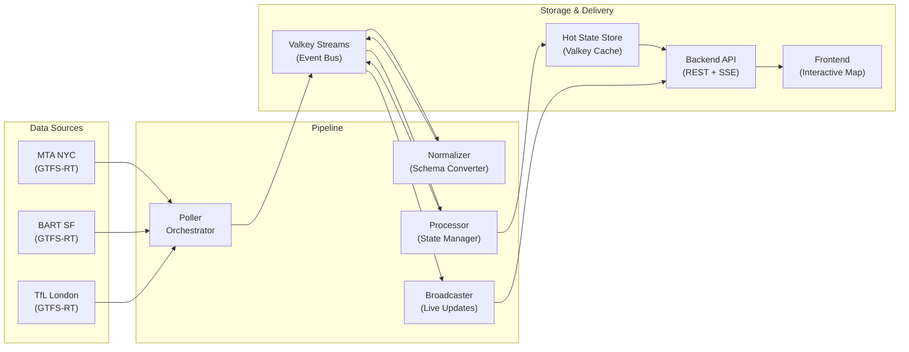

# Pipeline Module

The Pipeline module is the **core processing engine** of OpenTransitMap. It transforms raw transit data from agencies into live, interactive maps that users can view in real-time.

## 🎯 **What It Does**

The pipeline acts as a **real-time data processing assembly line** that:

1. **Ingests** raw transit data from agencies (MTA, BART, TfL, etc.)
2. **Normalizes** agency-specific data into standardized formats
3. **Processes** events to maintain authoritative vehicle state
4. **Computes** scoped frames for active viewports
5. **Broadcasts** live updates to connected users
6. **Serves** data through REST APIs and streaming interfaces

## 🏗️ **Architecture Overview**



## 📁 **Module Structure**

```
pipeline/
├── README.md                    # This file
├── processor/                   # Main processor module
│   ├── README.md               # Detailed processor documentation
│   ├── processor.ts            # Main processor implementation
│   ├── processor-config.ts     # Configuration management
│   ├── processor-metrics.ts    # Metrics collection
│   ├── processor-types.ts      # Interfaces and types
│   ├── components/             # Reusable components
│   └── __tests__/              # Test suite
├── topics.ts                   # Stream topic definitions
└── processor-old.ts            # Legacy processor (backup)
```

## 🔄 **Data Flow**

### **1. Ingest Layer**
Raw transit data flows from agencies into the system:

```typescript
// Poller fetches data from agencies
MTA GTFS-RT → Poller → Valkey Streams (vehicles.raw)
BART GTFS-RT → Poller → Valkey Streams (vehicles.raw)
TfL GTFS-RT → Poller → Valkey Streams (vehicles.raw)
```

### **2. Normalization**
Agency-specific data gets converted to standard format:

```typescript
// Normalizer converts to house schemas
vehicles.raw → Normalizer → events.normalized
```

### **3. Processing**
The processor maintains authoritative state:

```typescript
// Processor updates state and computes frames
events.normalized → Processor → Hot State + state.delta
```

### **4. Broadcasting**
Live updates get distributed to users:

```typescript
// Broadcaster sends updates to connected clients
state.delta → Broadcaster → WebSocket/SSE → Frontend
```

## 🎯 **Key Components**

### **Processor Module** (`processor/`)
The **heart** of the pipeline. Maintains vehicle state and computes frames:
- **Event Processing**: Handles vehicle upserts/removes
- **State Management**: Per-city vehicle positions
- **Frame Computation**: Scoped frames for viewports
- **Resilience**: Circuit breakers, retry policies
- **Monitoring**: Comprehensive metrics


### **Topics** (`topics.ts`)
Defines stream topics used across the pipeline:
- `events.normalized`: Canonical vehicle events
- `state.delta`: Vehicle change events
- Consumer groups: `normalizer`, `processor`, `broadcaster`

## 🚀 **Usage**

### **Starting the Pipeline**

```typescript
import { Processor } from './pipeline/processor/processor.js';
import { createValkeyStreamsBus } from '@open-transit-map/infra';

// Create event bus
const bus = createValkeyStreamsBus(client, { maxLen: 10000 }, logger);

// Create processor
const processor = new Processor(store, bus, logger);

// Start processing
await processor.start();
```

### **Development Mode**

For development and testing, use the `opentransit-mock` service which provides synthetic vehicle data:

```bash
# Start the mock service (already configured in docker-compose)
docker-compose up opentransit-mock
```

The mock service publishes synthetic vehicle events to Valkey streams, providing realistic test data for the processor.

## ⚙️ **Configuration**

The pipeline supports extensive configuration:

### **Environment Variables**

```bash
# Event bus configuration
EVENT_BUS=valkey                    # or 'memory'
VALKEY_URL=redis://127.0.0.1:6379
VALKEY_STREAM_MAXLEN=10000

# Processor configuration
PROCESSOR_MAX_VEHICLES_PER_CITY=10000
PROCESSOR_MAX_VEHICLE_AGE_MS=300000
PROCESSOR_CLEANUP_INTERVAL_MS=60000

# Retry and resilience
PROCESSOR_MAX_RETRIES=3
PROCESSOR_CIRCUIT_BREAKER_THRESHOLD=5
```

### **Programmatic Configuration**

```typescript
import { createProcessorConfig } from './pipeline/processor/processor.js';

const config = createProcessorConfig({
  maxVehiclesPerCity: 5000,
  enableDetailedLogging: true,
  circuitBreakerThreshold: 10
});

const processor = new Processor(store, bus, logger, config);
```

## 📊 **Monitoring & Observability**

The pipeline provides comprehensive monitoring:

### **Metrics**
- Event processing rates
- State management statistics
- Frame computation performance
- Error rates and types
- Circuit breaker state

### **Logging**
- Structured JSON logs (Pino)
- Correlation IDs for tracing
- Performance timing
- Error context

### **Health Checks**
- Processor status
- Stream connectivity
- Cache health
- Memory usage

## 🧪 **Testing**

The pipeline includes comprehensive tests:

```bash
# Run all pipeline tests
yarn test src/pipeline/

# Run processor tests specifically
yarn test src/pipeline/processor/__tests__/

# Run with coverage
yarn test:coverage src/pipeline/
```

## 🔧 **Development**

### **Adding New Event Types**

1. Define schema in `packages/types`
2. Update normalizer to handle new type
3. Add processor logic for new events
4. Update tests

### **Adding New Cities**

1. Add city configuration
2. Update poller to fetch city data
3. Configure normalizer for city-specific rules
4. Test with real data

### **Modifying Processing Logic**

1. Update processor components
2. Add new metrics
3. Update configuration
4. Add comprehensive tests

## 🚨 **Error Handling**

The pipeline includes robust error handling:

- **Validation**: All data validated with Zod schemas
- **Retry Logic**: Exponential backoff for transient failures
- **Circuit Breakers**: Prevent cascading failures
- **Graceful Degradation**: Continue processing other events
- **Detailed Logging**: All errors logged with context

## 🔄 **Lifecycle Management**

The pipeline follows a clear lifecycle:

1. **Initialization**: Load configuration, create components
2. **Start**: Subscribe to streams, start processing
3. **Processing**: Handle events, update state, broadcast changes
4. **Stop**: Unsubscribe, cleanup resources, graceful shutdown

## 📈 **Performance Considerations**

- **Memory Management**: Automatic cleanup of old data
- **Spatial Indexing**: Efficient viewport queries
- **Parallel Processing**: Concurrent event processing
- **Stream Retention**: Aggressive trimming to prevent memory growth
- **Circuit Breakers**: Prevent resource exhaustion

## 🎯 **Integration Points**

The pipeline integrates with:

- **Valkey Streams**: Event bus and caching
- **Backend API**: REST endpoints and SSE
- **Frontend**: Real-time map updates
- **Observability**: Metrics, logs, and tracing
- **Configuration**: Environment variables and overrides

## 🔮 **Future Enhancements**

- **Multi-region Support**: Process multiple cities simultaneously
- **Advanced Analytics**: Real-time insights and trends
- **Machine Learning**: Predictive vehicle positioning
- **Edge Computing**: Process data closer to users
- **Stream Processing**: More sophisticated event processing

## 📚 **Related Documentation**

- [Processor Module](./processor/README.md) - Detailed processor documentation
- [Architecture Overview](../../../docs/ARCHITECTURE.md) - System architecture
- [ADRs](../../../docs/ADRs/) - Architecture Decision Records
- [API Documentation](../routes/README.md) - REST API documentation

This pipeline is the backbone of OpenTransitMap, transforming raw transit data into the live, interactive experience that users see on their maps.
