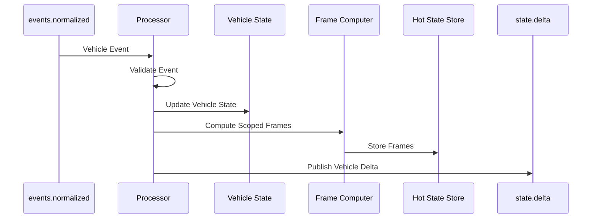

# Processor Module

The Processor module is the **heart** of the OpenTransitMap pipeline. It maintains the authoritative state of all vehicles and ensures that users see accurate, up-to-date information as they pan and zoom around the map.

## 🎯 **What It Does**

The processor acts as a **real-time state manager** that:

1. **Consumes** normalized vehicle events from the `events.normalized` stream
2. **Maintains** per-city vehicle state in memory
3. **Computes** scoped frames for active viewports
4. **Publishes** vehicle deltas to the `state.delta` stream
5. **Provides** comprehensive metrics and monitoring

## 🏗️ **Architecture**

The processor follows **SOLID principles** with a clean, modular architecture:

```
Processor (Main Class)
├── Configuration Management
├── Event Validation
├── Vehicle State Management
├── Frame Computation
├── Circuit Breaker (Resilience)
├── Retry Policy (Error Handling)
└── Metrics Collection
```

## 📁 **File Structure**

```
processor/
├── README.md                    # This file
├── index.ts                     # Clean module exports
├── processor.ts                 # Main processor implementation
├── processor-config.ts          # Configuration with Zod validation
├── processor-metrics.ts         # Metrics collection and reporting
├── processor-types.ts           # All interfaces and type definitions
├── components/                  # Reusable components
│   ├── vehicle-state-manager.ts    # Vehicle state management
│   ├── frame-computer.ts           # Frame computation logic
│   ├── event-validator.ts          # Event validation with Zod
│   ├── circuit-breaker.ts          # Circuit breaker pattern
│   └── retry-policy.ts             # Retry logic with backoff
└── __tests__/                   # Comprehensive test suite
    └── processor-refactored.test.ts
```

## 🔄 **How It Works**

### **1. Event Processing Flow**



### **2. Key Components**

#### **Event Validator**
- Validates incoming events with Zod schemas
- Ensures data integrity before processing
- Provides detailed error messages for debugging

#### **Vehicle State Manager**
- Maintains per-city vehicle positions in memory
- Handles cleanup of old data
- Provides efficient spatial queries (vehicles in bounding box)

#### **Frame Computer**
- Computes what vehicles are visible in each viewport
- Filters vehicles by bounding box
- Creates scoped frames for efficient delivery

#### **Circuit Breaker & Retry Policy**
- Prevents cascading failures
- Handles temporary outages gracefully
- Ensures system resilience

#### **Metrics & Monitoring**
- Tracks processing performance
- Monitors error rates
- Provides observability for operations

## 🚀 **Usage**

### **Basic Usage**

```typescript
import { Processor } from './processor.js';

// Create processor with dependencies
const processor = new Processor(store, bus, logger);

// Start processing events
await processor.start();

// Stop processing
await processor.stop();
```

### **Advanced Usage with Custom Configuration**

```typescript
import { Processor, createProcessorConfig } from './processor.js';

// Custom configuration
const config = createProcessorConfig({
  maxVehiclesPerCity: 5000,
  enableDetailedLogging: true,
  circuitBreakerThreshold: 10
});

// Create processor with custom config
const processor = new Processor(store, bus, logger, config);
```

### **Testing with Custom Dependencies**

```typescript
import { Processor } from './processor.js';
import { MockVehicleStateManager } from './test-utils.js';

// Create processor with mocked dependencies
const processor = new Processor(store, bus, logger, config, {
  vehicleStateManager: new MockVehicleStateManager(),
  metrics: new MockMetrics()
});
```

## ⚙️ **Configuration**

The processor supports extensive configuration through environment variables and programmatic overrides:

### **Environment Variables**

```bash
# Vehicle state limits
PROCESSOR_MAX_VEHICLES_PER_CITY=10000
PROCESSOR_MAX_VEHICLE_AGE_MS=300000

# Cleanup settings
PROCESSOR_CLEANUP_INTERVAL_MS=60000

# Retry configuration
PROCESSOR_MAX_RETRIES=3
PROCESSOR_RETRY_BASE_DELAY_MS=1000
PROCESSOR_RETRY_MAX_DELAY_MS=10000

# Circuit breaker settings
PROCESSOR_CIRCUIT_BREAKER_THRESHOLD=5
PROCESSOR_CIRCUIT_BREAKER_TIMEOUT_MS=30000

# Feature flags
PROCESSOR_ENABLE_METRICS=true
PROCESSOR_ENABLE_DETAILED_LOGGING=false
```

### **Programmatic Configuration**

```typescript
const config = createProcessorConfig({
  maxVehiclesPerCity: 5000,
  maxVehicleAgeMs: 5 * 60 * 1000, // 5 minutes
  cleanupIntervalMs: 60 * 1000,   // 1 minute
  maxRetries: 3,
  retryBaseDelayMs: 1000,
  retryMaxDelayMs: 10000,
  circuitBreakerThreshold: 5,
  circuitBreakerTimeoutMs: 30000,
  enableMetrics: true,
  enableDetailedLogging: false
});
```

## 📊 **Monitoring & Metrics**

The processor provides comprehensive metrics for monitoring:

### **Event Processing Metrics**
- Total events processed
- Success/failure rates
- Average processing time
- Error counts by type

### **State Management Metrics**
- Total vehicles per city
- Memory usage estimates
- Cleanup statistics

### **Performance Metrics**
- Frame computation times
- Circuit breaker state
- Retry attempt counts

### **Example Metrics Output**

```typescript
const metrics = processor.getMetrics();
console.log(metrics);
// {
//   eventsProcessed: 1250,
//   eventsProcessedSuccess: 1245,
//   eventsProcessedError: 5,
//   successRate: 99.6,
//   averageProcessingTime: 12.5,
//   frameComputations: 89,
//   averageFrameComputationTime: 45.2,
//   errorCounts: { "validation-error": 3, "processing-error": 2 }
// }
```

## 🧪 **Testing**

The processor includes comprehensive tests covering:

- ✅ Event processing (upsert/remove)
- ✅ State management
- ✅ Frame computation
- ✅ Error handling
- ✅ Circuit breaker behavior
- ✅ Retry policies
- ✅ Configuration validation
- ✅ Metrics collection

### **Running Tests**

```bash
# Run all processor tests
yarn test src/pipeline/processor/__tests__/

# Run with coverage
yarn test:coverage src/pipeline/processor/__tests__/
```

## 🔧 **Development**

### **Adding New Components**

1. Create the component in `components/`
2. Define the interface in `processor-types.ts`
3. Add to the processor constructor
4. Update tests
5. Export from `index.ts`

### **Modifying Configuration**

1. Update `ProcessorConfigSchema` in `processor-config.ts`
2. Add environment variable support
3. Update validation logic
4. Add tests for new options

### **Adding Metrics**

1. Define metric in `ProcessorMetrics` interface
2. Implement in `DefaultProcessorMetrics`
3. Add to `ProcessorMetricsSummary`
4. Update tests

## 🚨 **Error Handling**

The processor includes comprehensive error handling:

- **Validation Errors**: Invalid events are logged and skipped
- **Processing Errors**: Retry with exponential backoff
- **Circuit Breaker**: Prevents cascading failures
- **Graceful Degradation**: Continues processing other events
- **Detailed Logging**: All errors are logged with context

## 🔄 **Lifecycle Management**

The processor follows a clear lifecycle:

1. **Initialization**: Load configuration, create components
2. **Start**: Subscribe to events, start cleanup interval
3. **Processing**: Handle events, update state, compute frames
4. **Stop**: Unsubscribe, cleanup resources, stop intervals

## 📈 **Performance Considerations**

- **Memory Management**: Automatic cleanup of old vehicle data
- **Spatial Indexing**: Efficient bounding box queries
- **Parallel Processing**: Concurrent frame computation
- **Circuit Breaker**: Prevents resource exhaustion
- **Metrics**: Monitor performance in real-time

## 🎯 **Integration with Pipeline**

The processor integrates seamlessly with the OpenTransitMap pipeline:

- **Input**: `events.normalized` stream (Valkey Streams)
- **Output**: `state.delta` stream + hot state store
- **Dependencies**: EventBus, InMemoryStore, Logger
- **Configuration**: Environment variables + programmatic overrides

This makes it easy to replace, scale, or modify the processor without affecting other pipeline components.
